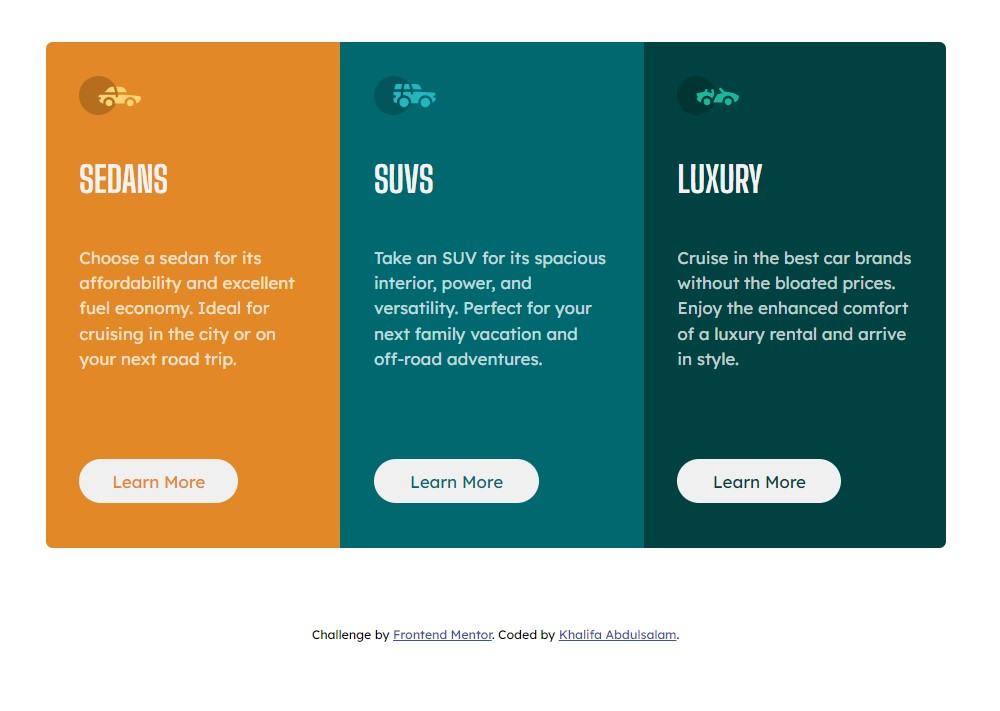
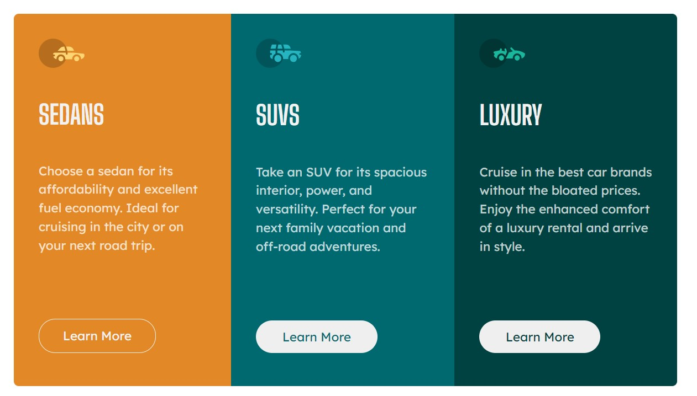

# Frontend Mentor - 3-column preview card component solution

This is a solution to the [3-column preview card component challenge on Frontend Mentor](https://www.frontendmentor.io/challenges/3column-preview-card-component-pH92eAR2-). Frontend Mentor challenges help you improve your coding skills by building realistic projects. 


## Table of contents

- [Overview](#overview)
  - [The challenge](#the-challenge)
  - [Screenshot](#screenshot)
  - [Links](#links)
  - [Built with](#built-with)
  - [What I learned](#what-i-learned)
  - [Continued development](#continued-development)
  - [Useful resources](#useful-resources)
- [Author](#author)
- [Acknowledgments](#acknowledgments)


## Overview

### The challenge

Users should be able to:

- the optimal layout of this design was made to suit the desktop layout and aswell as responsive for mobile versions. 
-The call-to-action button was designed as an interactive element potraying certain colour transition and transformation in its hover and focus states.

### Screenshot






### Links

- Solution URL:(https://github.com/khalifaomeiza/3_column_preview_card.git)
- Live Site URL:  (https://khalifaomeiza.github.io/3_column_preview_card/) 


### Built with

- Semantic HTML5 markup
- CSS custom properties
- Flexbox
- Media Query


### What I learned
RESPONSIVE WEB DEVELOPMENT


```css
.proud-of-this-css {
  
    @media (max-width: 800px) {
        .car-brands{
            display:block;
            margin: 30px auto;
            max-width:250px;
            height: 1200px;
        }

        .brand-name {
            padding: 20px 0px;
        }

}
}
```

### Continued development

The areas i would want to focus on in future projects would be;
- In making the design responsive.
- identifying the CSS breakpoint
- improving my CSS Media Query Syntax and usage
- Trying a Mobile-first approach


### Useful resources

- [Google fonts](https://fonts.google.com/) - This helped me in setting my font style.


## Author

- Frontend Mentor - [@khalifaomeiza](https://www.frontendmentor.io/profile/khalifaomeiza)
- Twitter - [@khalifaomeiza](https://www.twitter.com/khalifaomeiza)


## Acknowledgments

My hat tip goes to my instructor at Loctech Training Institute, Mr. Promise Udo. He was my inspiration and i owe my successes to him. Then again, to my family, to my brother Fahad and my dearest Fatima, Thank you.


